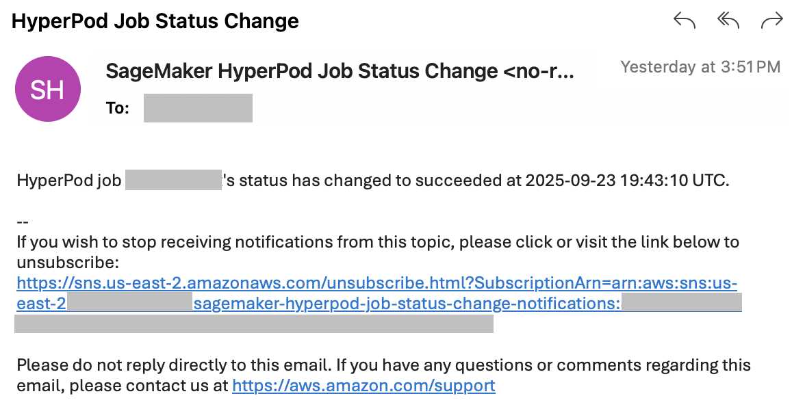

# SageMaker Job Monitoring
This folder features a collection of observability scripts surrounding Nova customization via SageMaker HyperPod and SageMaker Training Jobs.
Please visit any of the below links to see instructions for using each of the scripts.

### Prerequisites:
#### General:
- boto3: Run ```pip install boto3```
### Usage:
* To get started, simply clone [this Github repository](https://github.com/aws-samples/amazon-nova-samples/tree/main) and refer to the script details below!
* Make sure you've refreshed your AWS credentials before running any of scripts in this library.

__Please note that these scripts are specifically designed for Nova Customization jobs.__

- [SageMaker Training Job & HyperPod Job Status Email Notifications](#sagemaker-training-job--hyperpod-job-status-email-notifications)
- [SageMaker Training Job & HyperPod Training Estimates](#sagemaker-training-job--hyperpod-training-estimates)
- [SageMaker Training Job & HyperPod Job Progress](#sagemaker-training-job--hyperpod-job-progress)

## SageMaker Training Job & HyperPod Job Status Email Notifications
This tool helps a user enable job status email notifications for their SageMaker Training Jobs (TJ) and HyperPod (HP) jobs. 
When a job's status gets changed from running to succeeded/failed, an email notification will be sent to the user's chosen email address(es). 
### Prerequisites:
#### HyperPod-Specific: 
- **Amazon CloudWatch Observability** must be installed on the EKS cluster running your HP jobs: This enables Container Insights logs to be generated. Information on how to install the add-on can be found [here](https://docs.aws.amazon.com/AmazonCloudWatch/latest/monitoring/install-CloudWatch-Observability-EKS-addon.html). 
### Usage:
If you want to check the parameters to use, run the following command:
```
python enable_sagemaker_job_notifs.py --help
```
#### Basic Usage
```
python enable_sagemaker_job_notifs.py --email [EMAIL(S) HERE] --region [REGION HERE] --platform [SMTJ or SMHP] --rate [# MINUTES]
```
#### Example Usage:
```
python enable_sagemaker_job_notifs.py --email test@amazon.com test2@gmail.com --region us-east-1 --platform SMHP --rate 15
```
#### Steps:
1. Run the above command, replacing the different parameters with your associated values.
2. After the stack is fully deployed, check your email(s) and confirm the subscription so you can receive email notifications when a job is completed. 

3. Once your TJ or HP job completes, you should get a notification to your email that looks similar to the below image. Each job entry in the email should contain: the job name, the updated status, timestamp that the event occurred. 

#### Parameters:
- **Email:** Include 1+ email that you want job notifications to go to, separated by a space between each email.  
- **Region:** Pick the region that you're deploying your jobs in (e.g. us-east-2). 
- **Platform:** Pick either SageMaker Training Job (SMTJ) updates or SageMaker HyperPod updates (SMHP).
- **Rate:** Only applicable for SageMaker HyperPod job notifications. This is the rate (in minutes) in which an EventBridge rule will be triggered to check if any job statuses have updated. 
### Disclaimers
* Container Insights logs (which are included as a part of the Amazon CloudWatch Observability add-on) are required to monitor HyperPod job statuses. 
  * As such, if these logs stop being created for any reason (e.g. add-on isn't updated), the HyperPod job notifications won't work.  
* The job status updates are only reported in UTC. 

------------------------------------------

## SageMaker Training Job & HyperPod Training Estimates

This script can be used to estimate training times for CPT/PPO/SFT/DPO training jobs on both SageMaker HyperPod and SageMaker Training Jobs.

### Prerequisites:
Ensure that you have access to the recipe that you plan on using for your training job. This recipe should be similar to 
this sample recipe below:

```
## Run config
run:
  name: "my-cpt-run"             
  model_type: "amazon.nova-micro-v1:0:128k"  
  model_name_or_path: "nova-micro/prod"
  replicas: 8                   
  data_s3_path: ""                
  output_s3_path: ""              

## Training specific configs
training_config:
  max_length: 8192               
  global_batch_size: 256           

  trainer:
    max_epochs: 1               

  model:
    hidden_dropout: 0.0          
    attention_dropout: 0.0       
    ffn_dropout: 0.0             

    optim:
      lr: 1e-5                 
      name: distributed_fused_adam 
      adam_w_mode: true       
      eps: 1e-06               
      weight_decay: 0.0        
      betas:                   
        - 0.9
        - 0.999
      sched:
        warmup_steps: 10     
        constant_steps: 0    
        min_lr: 1e-6         
```

### Usage:
Run the script by using a command similar to: 
``` python get_training_time_estimate.py ```

### Example Execution:
```
% python3 get_training_time_estimate.py

Select training type:
1. cpt
2. ppo
3. sft
4. dpo
Enter the number of your choice: 1
Select model type:
1. nova-micro
2. nova-lite
3. nova-pro
Enter the number of your choice: 3
Enter path to YAML file: test-recipe.yaml
Enter dataset sample size (press Enter to use default 100,000): 100000

Estimated training time (cpt, nova-pro, 8 P5s, 256 GBS, 8192 max_length): 1 day 6 hours

Please note that these estimates are approximate projections and should not be interpreted as definitive training 
durations. Please monitor CloudWatch logs for more accurate progress and estimates.
```

Simply walk through the prompts to receive your training time estimate. Please note that these estimates
are approximate projections and should not be interpreted as definitive training durations. Actual training
times may vary significantly based on multiple factors. For more accurate estimates, please check CloudWatch
logs while your training job is running.

------------------------------------------

## SageMaker Training Job & HyperPod Job Progress
These scripts enable users to learn more about the training details for SageMaker Training Jobs and HyperPod jobs.
Specifically, users can learn the following (depending on job status):
* Approximations for how long training is expected to take for in-progress jobs
* Job failure reason
* Total training time of completed jobs
### Prerequisites / Limitations:
#### HyperPod-Specific:
- The **HyperPod CLI** must be installed where you are executing this script. Information on how to install the CLI can be found [here](https://github.com/aws/sagemaker-hyperpod-cli/tree/release_v2).
- This script only supports HyperPod clusters that are orchestrated by EKS, not Slurm. See [here](https://docs.aws.amazon.com/sagemaker/latest/dg/sagemaker-hyperpod.html) for more details.
- Because of how HyperPod pushes logs to CloudWatch, it is possible for logs of different jobs to end up in the same log stream - with no way of differentiating between jobs.
Due to this limitation, the HyperPod script will intentionally exit if it detects that there is more than 1 job currently running for a given cluster.
### Usage:
If you want to check the parameters to use, run the following commands:
```
# Training Jobs
python get-training-job-progress.py --help

# HyperPod
python get-hyperpod-job-progress.py --help
```
#### Basic Usage
```
# Training Jobs
python get-training-job-progress.py [-h] --job-name JOB_NAME --region REGION --num-dataset-samples NUM_DATASET_SAMPLES

# HyperPod
python get-hyperpod-job-progress.py [-h] --cluster-name CLUSTER_NAME --job-name JOB_NAME --namespace NAMESPACE --region REGION --num-dataset-samples NUM_DATASET_SAMPLES --num-epochs NUM_EPOCHS --batch-size BATCH_SIZE
```
#### Parameters:
_Training Jobs_
- **job-name:** The name of the SageMaker Training Job to check job progress of.
- **region:** The region of your SageMaker Training Job (e.g. us-east-2).
- **num-dataset-samples:** An _approximate_ count of the number of input samples you have stored in S3. For more information, please see [AWS documentation](https://docs.aws.amazon.com/nova/latest/userguide/custom-distill-prepare.html).

_HyperPod_
- **cluster-name:** The name of the HyperPod cluster that your job is running in.
- **job-name** The name of the HyperPod job to check job progress of.
- **namespace** The Kubernetes namespace that your job is running within.
- **region:** The region of your SageMaker Training Job (e.g. us-east-2).
- **num-dataset-samples:** An _approximate_ count of the number of input samples you have stored in S3. For more information, please see [AWS documentation](https://docs.aws.amazon.com/nova/latest/userguide/custom-distill-prepare.html).
- **num-epochs:** The number of epochs that your job is using. You can find this value in your recipe YAML file as `max_epochs`.
- **batch-size:** The global batch size of your job. You can find this value in your recipe YAML file as `global_batch_size`.
#### Example Usage:
```
# Training Jobs
python get-training-job-progress.py --region us-east-1 --job-name my-training-job --num-dataset-samples 1000
Job my-training-job succeeded at 19:34 UTC 09/26/2025. Training time was 11 minutes.


python get-training-job-progress.py --region us-east-1 --job-name my-other-training-job --num-dataset-samples 1000
Job my-other-training-job failed at 02:48 UTC 09/26/2025 due to "AlgorithmError: Algorithm container exited with error."


python get-training-job-progress.py --region us-east-1 --job-name in-progress-job --num-dataset-samples 1000
Please note that these estimates are approximate projections and should not be interpreted as definitive training durations.
Training for job in-progress-job is approximately 37.8% complete. Estimated training time remaining: 324 minutes [5.4 hours]
```

```
# HyperPod
python get-hyperpod-job-progress.py --region us-east-1 --cluster-namemy-hyperpod-cluster --num-dataset-samples 100000 --namespace default --num-epochs 10 --batch-size 256 --job-name my-job
Job 'my-job' succeeded at 2025-07-15T20:47:04Z

python get-hyperpod-job-progress.py --region us-east-1 --cluster-name my-hyperpod-cluster --num-dataset-samples 100000 --namespace default --num-epochs 10 --batch-size 256 --job-name my-job
Job 'my-job' failed at 2025-07-14T15:15:28Z. Kubernetes provided the following failure message: 'PyTorchJob my-job is failed because 1 Master replica(s) failed.'

python get-hyperpod-job-progress.py --region us-east-1 --cluster-name my-hyperpod-cluster --num-dataset-samples 100000 --namespace default --num-epochs 10 --batch-size 256 --job-name in-progress-job
Please note that these estimates are approximate projections and should not be interpreted as definitive training durations.
Training for job 'in-progress-job' is approximately 37.8% complete. Estimated training time remaining: 324 minutes [5.4 hours]
```
### Disclaimers
* Please note that these estimates are approximate projections and should not be interpreted as definitive training durations. Please monitor CloudWatch logs for full details.
