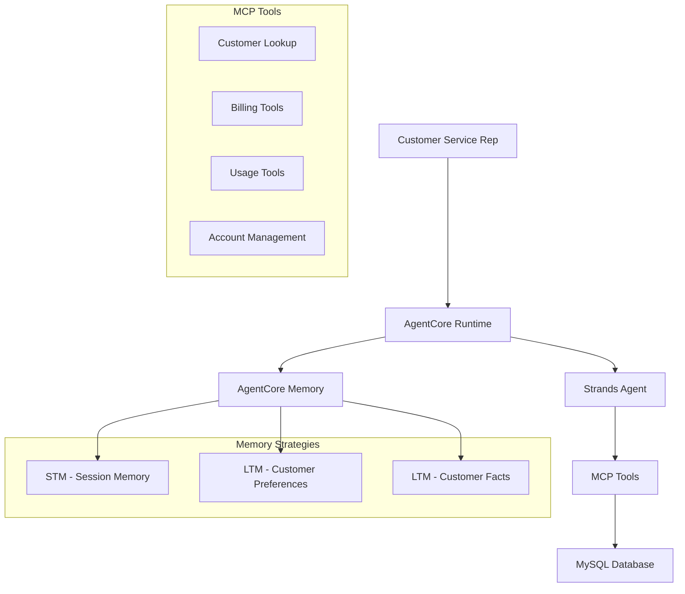

# Design Document

## Overview

The Telecom AgentCore Runtime is a sophisticated customer service agent that combines the existing MCP server functionality with Amazon Bedrock AgentCore memory capabilities. The system provides intelligent customer support with conversation persistence, learning capabilities, and seamless integration with the telecom customer database.

## Architecture

### High-Level Architecture



### Component Integration

The runtime integrates three main components:
1. **BedrockAgentCoreApp**: Provides the application framework and deployment infrastructure
2. **Strands Agent**: Handles conversation flow and tool orchestration
3. **AgentCore Memory**: Manages conversation persistence and learning

## Components and Interfaces

### 1. Memory Configuration

**AgentCoreMemoryConfig**
- Manages memory initialization and configuration
- Handles customer_id extraction and actor_id mapping
- Configures retrieval strategies for different memory types

**Memory Strategies:**
- `summaryMemoryStrategy`: Session summarization with namespace `/summaries/{actorId}/{sessionId}`
- `userPreferenceMemoryStrategy`: Customer preference learning with namespace `/preferences/{actorId}`
- `semanticMemoryStrategy`: Factual information extraction with namespace `/facts/{actorId}`

### 2. Agent System

**Strands Agent Configuration:**
- Model: Amazon Nova Pro (us.amazon.nova-pro-v1:0)
- Temperature: 0.7 (balanced creativity and consistency)
- Max tokens: 4000 (sufficient for complex customer interactions)
- Tools: All existing MCP tools from mcp_server_example.py

**System Prompt:**
Specialized for telecom customer service with emphasis on:
- Professional customer service tone
- Efficient problem resolution
- Memory utilization for personalized service
- Clear communication of technical information

### 3. Database Integration

**Connection Management:**
- SQLAlchemy engine for MySQL connectivity
- Connection pooling for performance
- Error handling and retry logic
- Secure credential management

**Query Optimization:**
- Prepared statements for security
- Efficient customer lookup patterns
- Batch operations where applicable

### 4. Streaming and Response Handling

**Response Processing:**
- Async streaming for real-time interaction
- Thinking tag filtering for clean output
- Structured logging for debugging
- Error boundary handling

## Data Models

### Memory Data Structure

```python
# Customer Memory Context
{
    "actor_id": "customer_12345",  # Derived from customer_id
    "session_id": "session_20241029_143022",
    "preferences": {
        "communication_style": "detailed",
        "preferred_contact_method": "email",
        "billing_preferences": "paperless"
    },
    "facts": {
        "account_type": "family_plan",
        "primary_concerns": ["data_usage", "billing"],
        "service_history": ["plan_upgrade_2024"]
    },
    "session_summary": "Customer inquired about data overage charges..."
}
```

### Tool Response Format

```python
# Standardized tool response
{
    "data": [...],  # Query results
    "count": int,   # Number of records
    "customer_id": str,  # For memory association
    "message": str  # Status or error message
}
```

## Error Handling

### Error Categories

1. **Database Errors**
   - Connection failures
   - Query timeouts
   - Data integrity issues

2. **Memory Errors**
   - Memory service unavailability
   - Retrieval failures
   - Storage limitations

3. **Agent Errors**
   - Model invocation failures
   - Tool execution errors
   - Response generation issues

### Error Recovery Strategies

- **Graceful Degradation**: Continue operation without memory if memory service fails
- **Retry Logic**: Automatic retry for transient failures
- **Fallback Responses**: Provide basic service when advanced features fail
- **User Communication**: Clear error messages without technical details

## Testing Strategy

### Unit Testing

**Memory Integration Tests:**
- Memory configuration validation
- Customer ID extraction logic
- Memory retrieval and storage operations
- Error handling scenarios

**Tool Integration Tests:**
- Database connection testing
- Query execution validation
- Response formatting verification
- Error condition handling

### Integration Testing

**End-to-End Scenarios:**
- Complete customer service interactions
- Memory persistence across sessions
- Multi-tool workflows
- Error recovery testing

**Performance Testing:**
- Response time benchmarks
- Memory retrieval performance
- Database query optimization
- Concurrent user handling

### Memory-Specific Testing

**Memory Strategy Testing:**
- Preference learning accuracy
- Fact extraction validation
- Session summarization quality
- Cross-session continuity

**Memory Retrieval Testing:**
- Relevance scoring validation
- Top-k result accuracy
- Namespace isolation
- Performance under load

## Implementation Considerations

### Security

- Secure database credential management
- Customer data privacy protection
- Memory data encryption
- Access control validation

### Performance

- Connection pooling for database efficiency
- Memory caching strategies
- Async operation optimization
- Resource usage monitoring

### Scalability

- Horizontal scaling support
- Memory service load balancing
- Database connection management
- Session state distribution

### Monitoring

- Structured logging for observability
- Performance metrics collection
- Error rate monitoring
- Memory usage tracking