# Amazon Nova Sonic Python Example: Session Continuation

This example demonstrates how to enable unlimited conversation length with Amazon Nova Sonic by implementing seamless session transitions. The application automatically creates and switches to new sessions in the background, allowing conversations to continue indefinitely without interruption or context loss.

## Overview

Amazon Nova Sonic sessions have an AWS-imposed time limit of approximately 8 minutes. This implementation solves that limitation by:

1. **Monitoring session duration** and detecting when a transition is needed
2. **Creating the next session in the background** while the current conversation continues
3. **Seamlessly switching sessions** with immediate handoff and no user-perceptible delay
4. **Preserving conversation context** through history transfer and audio buffering

**Key Achievement:** 98.2% productive conversation time with only 1.8% overhead for transitions.

## How It Works

```mermaid
graph LR
    A["🟢 Session 1<br/>0-6 min<br/>Normal Operation"] --> B["🔍 Monitor<br/>6:00-8:00<br/>Create next session"]
    B --> C["💾 Buffer Audio<br/>Last 10s<br/>of transition"]
    C --> D["⚡ Handoff<br/>When ready<br/>(6:00-8:00)"]
    D --> E["🟢 Session 2<br/>Continue<br/>indefinitely"]

    style A fill:#90EE90
    style E fill:#90EE90
    style B fill:#FFD700
    style D fill:#FFB6C1
```



### The Transition Process

**Phase 1: Normal Operation (0-6 min)**
- Session 1 runs normally
- No overhead or special processing

**Phase 2: Monitoring (6:00-8:00, ~2 mins)**
- Threshold reached (configurable, default 6 min)
- System waits for assistant to start speaking
- Next session creation begins in background

**Phase 3: Buffering (last 10 seconds of user audio during the transition)**
- Assistant starts speaking (AUDIO contentStart) - triggers buffering
- Audio buffering activates for 10-second window
- Captures user input/interruptions/barge-ins during transition window
- Next session completes initialization

**Phase 4: Handoff (anytime between 6:00-8:00 when time is right)**
- Conversation history transferred to Session 2
- Buffered audio transferred to Session 2
- Session 2 promoted to active
- Session 1 closed in background

**Phase 5: Continuation**
- Session 2 now active
- Process repeats when Session 2 approaches its limit

## Why Audio Buffering?

The audio buffer captures the **user's audio input** during the transition window - the critical period between when the assistant starts speaking and when Session 2 is ready to accept input:

**What Gets Buffered:**
- ✅ User interruptions/barge-ins during assistant's response
- ✅ User's follow-up questions immediately after assistant finishes
- ✅ Any user audio during the transition window

**What Does NOT Get Buffered:**
- ❌ Assistant's audio response (goes directly to user's speakers)
- ❌ Audio from before the transition starts

**Without buffering:** User speech during the transition window would be lost because Session 2 isn't ready yet to receive input.

**With buffering:** All user audio is preserved and replayed to Session 2, ensuring zero loss of user input.

## Key Features

- **Seamless Transitions**: Immediate handoff with no user-perceptible delay
- **Zero Conversation Loss**: Audio buffering prevents losing user input during transitions
- **Memory Efficient**: Only 320 KB buffer (10s audio at 16 kHz), active only during transitions
- **Automatic Recovery**: Dead session detection with 30s timeout
- **Full Observability**: Optional session recording and detailed logging

## Prerequisites

- Python 3.12 or higher
- AWS Account with Bedrock access
- AWS CLI configured with appropriate credentials
- Audio input/output device (microphone and speakers)

**Required packages:**

```
pyaudio>=0.2.13
rx>=3.2.0
smithy-aws-core>=0.0.1
pytz
aws_sdk_bedrock_runtime>=0.1.0,<0.2.0
```

## Installation

1. Create and activate a virtual environment:

First, navigate to the root folder of the project and create a virtual environment:

```bash
# Create a virtual environment
python -m venv .venv

# Activate the virtual environment
# On macOS/Linux:
source .venv/bin/activate
# On Windows:
# .venv\Scripts\activate
```

2. Install all dependencies:

With the virtual environment activated, install the required packages:

```bash
python -m pip install -r requirements.txt --force-reinstall
```

3. Configure AWS credentials:

The application uses environment variables for AWS authentication. Set these before running the application:

```bash
export AWS_ACCESS_KEY_ID="your-access-key"
export AWS_SECRET_ACCESS_KEY="your-secret-key"
export AWS_DEFAULT_REGION="us-east-1"
```

## Quick Start

1. Run the example:
```bash
python nova_sonic_with_session_manager.py
```

2. The application will:
   - Start a conversation with Nova Sonic
   - Monitor session duration
   - Automatically transition to new sessions as needed
   - Log all transitions to console
   - Save session recordings (if enabled)

## Configuration Parameters

| Parameter | Default | Description |
|-----------|---------|-------------|
| `transition_threshold_seconds` | 360 | When to start monitoring for transition (6 min) |
| `audio_buffer_duration_seconds` | 10 | Size of audio buffer (10s = 320 KB at 16 kHz) |
| `audio_start_timeout_seconds` | 100 | Max wait for assistant to start speaking |
| `next_session_ready_timeout_seconds` | 30 | Timeout before recreating dead session |
| `enable_session_recording` | true | Record all sessions to files |
| `recording_output_dir` | ./session_recordings | Where to save recordings |

### Recommended Settings

**For Testing (shorter sessions):**
```json
{
  "transition_threshold_seconds": 10,
  "audio_buffer_duration_seconds": 10
}
```

**For Production (8 min AWS limit):**
```json
{
  "transition_threshold_seconds": 360,
  "audio_buffer_duration_seconds": 10
}
```

## Architecture


## Key Components

### `SessionTransitionManager`
Core orchestrator that:
- Manages current and next sessions
- Routes audio to appropriate session
- Monitors session duration
- Handles transition logic
- Manages audio buffer lifecycle

### `BedrockStreamManager`
Handles bidirectional streaming with AWS Bedrock:
- Audio input/output streaming
- Event processing
- Session lifecycle management
- Tool use processing

### `AudioStreamer`
Manages audio I/O:
- Microphone input capture
- Speaker output playback
- Integration with session manager

## Performance Metrics

- **Transition Time**: Immediate handoff with no user-perceptible delay
- **Total Overhead**: Minimal per session
- **Efficiency**: 98.2% productive time
- **Memory**: 320 KB buffer at 16 kHz (67% reduction vs continuous buffering)
- **User Impact**: Zero (completely transparent)

## Logging and Debugging

Enable detailed logging in `session_config.json`:
```json
{
  "session_logging": {
    "log_transitions": true,
    "log_barge_in_events": true,
    "log_audio_events": true
  }
}
```

**Log Output Example:**
```
[THRESHOLD] Duration 360.5s >= threshold 360s - monitoring for transition
[AUDIO_START] AUDIO contentStart detected - starting buffer and initiating transition
[TRANSITION] Creating next session in background
[TRANSITION] Next session ready - transferring history (5 messages, 2.3 KB)
[TRANSITION] Buffer transfer complete - 2.1s audio sent
[PROMOTION] Session promoted - now active
```

## Session Recordings

When `enable_session_recording` is true, the system saves:
- `session_1_recording.json` - First session events
- `session_2_recording.json` - Second session events
- etc.

Each recording contains:
- Full conversation history
- Audio events
- Transition timestamps
- Session metadata

## Troubleshooting

**Session transitions taking too long:**
- Check network latency to Bedrock
- Verify `next_session_ready_timeout_seconds` is adequate
- Review logs for session creation delays

**Audio loss during transition:**
- Increase `audio_buffer_duration_seconds` (default 10s should be sufficient)
- Check logs for buffer overflow warnings
- Verify audio processing isn't blocking

**Transitions not triggering:**
- Verify `transition_threshold_seconds` is less than AWS timeout
- Check that assistant is speaking (required for transition)
- Review `audio_start_timeout_seconds` setting

## Related Examples

- **[resume-conversation](../../repeatable-patterns/resume-conversation)**: Resume conversations across different sessions (cross-session resumption)
- **[chat-history-logger](../../repeatable-patterns/chat-history-logger)**: Log and analyze conversation history
- **[token-usage-logger](../../repeatable-patterns/token-usage-logger)**: Monitor token consumption

## Detailed Sequence Diagram


